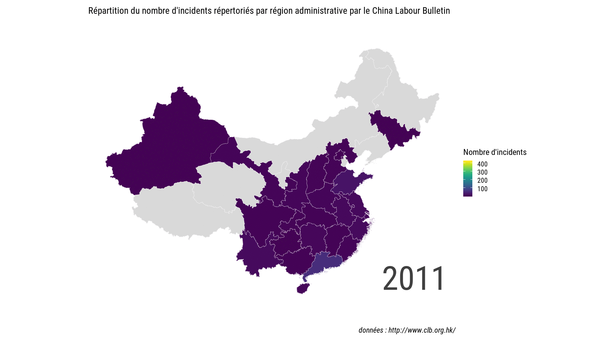
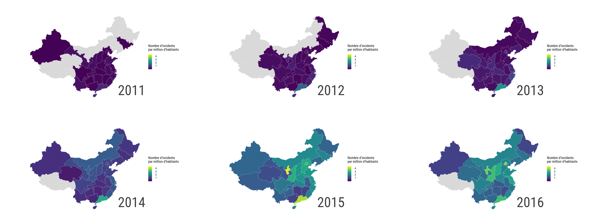

<style>
body {
text-align: justify}
</style>

```{r setup, include=FALSE}
library("tidyverse")
library("sf")
library("magick")

source("00-helpers.R", encoding = "UTF-8")
source("02-read_data.R", encoding = "UTF-8")

# format data ------------------------------------------------------------------

# add the year
df <- mutate(df, year = format(date, "%Y")) %>%
  mutate(year_s = ifelse(year == "2011", year, paste0("´", substr(year, 3, 4))))
```

## Données

Les données ici explorées sont issues du China Labour Bulletin (<http://www.clb.org.hk/>). La période considérée va de début 2011 à fin 2017 (ce qui correspond à l'ensemble de l'historique disponible).

L'un des objectifs du China Labour Bulletin est de recenser les différents incidents impliquant des travailleurs dans l'ensemble de la Chine. Les revendications à l'origine de ces incidents sont multiples : obtenir une meilleure sécurité sociale, des conditions de travail décentes, une équalité dans les salaires, etc.

Chaque incident répertorié est décrit par une date, un titre, une description plus ou moins détaillée, la région administrative dans laquelle il a eu lieu, le secteur de l'entreprise impliquée (construction, transport, etc.), le nombre de personnes concernées, l'employeur et le type d'entreprise (privée, publique, etc.), la forme de l'incident (sit-in, manifestation, etc.), les demandes formulées par les travailleurs et enfin la réponse apportée.

```{r data, cols.print=4, echo=FALSE}
df %>%
  slice(1:5) %>%
  select(-year, -year_s) %>%
  mutate(title = paste0(substring(title, 1, 30), "...")) %>%
  mutate(description = paste0(substring(description, 1, 30), "...")) %>%
  setNames(str_to_title(gsub("_", " ", names(.))))
```

## Exploration univariée et évolution annuelle

### Répartition des incidents au cours du temps

L'un des premièrs axes d'exploration possibles consiste à étudier la distribution des incidents répertoriés par le China Labour Bulletin au cours du temps.

```{r time_series, echo=FALSE, fig.width=16, fig.height=9}
# count the number of incidents by week
ts_week <- df %>%
  mutate(week = lubridate::week(date)) %>%
  mutate(week = ifelse(week %in% as.character(seq_len(9)),
                       paste0("0", week), week)) %>%
  unite(timespan, year, week, sep = "-", remove = TRUE) %>%
  group_by(timespan) %>%
  count() %>%
  ungroup() %>%
  mutate(id = "Par semaine")

# count the number of incidents by month
ts_month <- df %>%
  mutate(timespan = format(date, "%Y-%m")) %>%
  group_by(timespan) %>%
  count() %>%
  ungroup() %>%
  mutate(id = "Par mois")

ts <- bind_rows(ts_week, ts_month) %>%
  mutate(id = factor(id, levels = c("Par semaine", "Par mois")))

ggplot(ts, aes(x = timespan, y = n)) +
  geom_line(aes(group = 1)) +
  scale_x_discrete(breaks = paste0(2012:2017, "-01")) +
  facet_wrap(~ id, ncol = 3, scales = "free") +
  labs(title = paste("Nombre d'incidents répertoriés par",
                     "le China Labour Bulletin entre 2011 et 2017"),
       subtitle = paste("Note : l'échelle des ordonnées est différente",
                        "pour chaque graphique"),
       x = "", y = "",
       caption = "données : http://www.clb.org.hk/") +
  theme_bw_2()
```

Si le nombre d'incidents a régulièrement augmenté entre 2011 et 2015, il semble diminuer depuis. Notons également la présence de pics importants lors des premiers jours de 2015 et de 2016.

Le graphique ci-après confirme la baisse du nombre d'incidents reportés depuis deux ans.

```{r year, echo=FALSE, fig.width=16, fig.height=9, message=FALSE}
# ---- year ----

# count(df, year, sort = TRUE)

year_lollipop <- draw_lollipop(
  df,
  var = "year",
  title = paste("En forte augmentation entre 2011 et 2015,",
                "le nombre d'incidents diminue depuis"),
  subtitle = paste("Évolution du nombre d'incidents répertoriés",
                   "par le China Labour Bulletin entre 2011 et 2017"),
  caption = "données : http://www.clb.org.hk/",
  panel.grid.major.y = element_blank()
) +
  scale_x_discrete(limits = as.character(rev(2011:2017)))

year_lollipop
```

### Répartition des incidents au sein des régions administratives

Après le temps, un autre axe d'analyse envisageable est l'espace.

Le graphique ci-après représente le nombre d'incidents répertoriés au sein de chaque région administrative lors des sept années concernées.

```{r province_1, echo=FALSE, fig.width=16, fig.height=9}
# ---- province ----

# count(df, province, sort = TRUE)

df_province <- mutate(df, province = ifelse(province == 0, NA, province))

province_lollipop <- draw_lollipop(
  df_province,
  var = "province",
  title = paste("La région de Guangdong (Canton) concentre",
                "la grande majorité des incidents"),
  subtitle = paste("Nombre d'incidents répertoriés par région",
                   "par le China Labour Bulletin"),
  caption = "données : http://www.clb.org.hk/",
  panel.grid.major.y = element_blank()
)

province_lollipop
```

La région de Guangdong - ou Canton - est la région qui concentre la plupart des incidents. Notons que cette région est aussi la plus peuplée de Chine.
À l'opposé, seuls quatre incidents ont été repertoriés au Tibet sur l'ensemble de la période étudiée.

Notons qu'il pourrait être intéressant de considérer le nombre d'incidents par nombre de travailleurs plutôt que le nombre d'incidents directement. Ceci nécessite cependant d'avoir à disposition une source de données fiable approximant le nombre de travailleurs au sein de chaque région. Un proxy valable consisterait à considérer la population de chaque région.

Une vision prenant en compte l'évolution du nombre d'incidents au cours de la période est donnée ci-dessous.

```{r province_2, echo=FALSE, fig.width=16, fig.height=9}
province_multilineplot <- draw_multilineplot(
  df = filter(df_province, !(is.na(province) | province == "Tibet")), 
  var = "province",
  by_var = "year_s",
  title = paste("L'évolution du nombre d'incidents suit une",
                "trajectoire plutôt semblable dans l'ensemble des régions"),
  subtitle = paste("Évolution du nombre d'incidents répertoriés par région",
                   "entre 2011 et 2017 par le China Labour Bulletin"),
  ncol = 6,
  caption = "données : http://www.clb.org.hk/"
)

province_multilineplot
```

L'évolution au sein de chaque région est semblable à celle observée globalement : une croissance du nombre d'incidents de 2011 à 2015 et une diminution de ceux-ci depuis.

### Répartition des incidents par type d'industrie

Plusieurs types d'industrie sont répertoriés mais deux se détachent en termes de nombres d'incidents : le secteur du bâtiment et les entreprises du secteur de la production industrielle.  
Viennent ensuite les transports et les services.

```{r industry_1, echo=FALSE, fig.width=16, fig.height=9}
# ---- industry ----

# count(df, industry, sort = TRUE)

industry_lollipop <- draw_lollipop(
  df,
  var = "industry",
  title = paste("Bâtiment et production sont les deux secteurs",
                "où le nombre d'incidents est le plus important"),
  subtitle = paste("Nombre d'incidents répertoriés par type d'industrie",
                   "par le China Labour Bulletin"),
  caption = "données : http://www.clb.org.hk/",
  panel.grid.major.y = element_blank()
)

industry_lollipop
```

Si l'on se concentre sur l'évolution annuelle, l'on peut noter la baisse généralisée du nombre d'incidents sur l'année 2017.

```{r industry_2, echo=FALSE, fig.width=16, fig.height=9}
industry_multilineplot <- draw_multilineplot(
  df,
  var = "industry",
  by_var = "year_s",
  title = paste("La baisse manifeste du nombre d'incidents en 2017 est",
                "observable dans l'ensemble des secteurs"),
  subtitle = paste("Évolution du nombre d'incidents répertoriés par type",
                   "d'industrie entre 2011 et 2017",
                   "par le China Labour Bulletin"),
  ncol = 3,
  caption = "données : http://www.clb.org.hk/"
)

industry_multilineplot
```

### Répartition des incidents par nombre de participants

Autre axe d'analyse possible, le nombre de participants impliqués dans chacun des incidents.
Le comptage est fait de façon qualitative plutôt que quantitative : entre 1 et 100 personnes impliquées, entre 100 et 1 000, entre 1 000 et 10 000 ou plus de 10 000 sont les différentes modalités possibles. 

```{r participants_1, echo=FALSE, fig.width=16, fig.height=9}
# ---- participants ----

# count(df, participants, sort = TRUE)

# remove the " Persons" suffix for aesthetic purposes
df_participants <- mutate(df, participants = gsub(" Persons", "", participants))

participants_lollipop <- draw_lollipop(
  df_participants,
  var = "participants",
  title = paste("La majorité des incidents impliquent des groupes",
                "de moins de 100 personnes"),
  subtitle = paste("Nombre d'incidents répertoriés par nombre de participants",
                   "par le China Labour Bulletin"),
  caption = "données : http://www.clb.org.hk/",
  panel.grid.major.y = element_blank()
)

participants_lollipop
```

La très grande majorité des incidents ont impliqué des groupes de 100 personnes ou moins.
Le nombre d'incidents réportoriés par le China Labour Bulletin où le nombre de travailleurs a dépassé 10 000 est de huit entre 2011 et fin 2017.

L'évolution année par année est sans grande surprise.

```{r participants_2, echo=FALSE, fig.width=16, fig.height=9}
participants_multilineplot <- draw_multilineplot(
  df_participants,
  var = "participants",
  by_var = "year_s",
  ncol = 3,
  title = paste("Aucun incident impliquant plus de 10 000 personnes",
                "n'a été répertorié lors des trois dernières années"),
  subtitle = paste("Évolution du nombre d'incidents répertoriés par nombre",
                   "de participants entre 2011 et 2017",
                   "par le China Labour Bulletin"),
  caption = "données : http://www.clb.org.hk/"
)

participants_multilineplot
```

### Répartition des incidents par employeur

Ci-après est représenté les douze employeurs les plus concernés en termes de nombre d'incidents. On y retrouve aussi bien des grands groupes nationaux (*State Grid,* *China Mobile* par exemple), que des *start-up* comme *Didi Chuxing* ou des groupes étrangers (*Walmart*).

Attention, les données n'étant pas parfaitement homogènes, il est possible et même probable que certains employeurs soient ortographiés différement au fil du temps, ce qui ajoute du bruit au résultat ici présenté.

```{r employer_1, echo=FALSE, fig.width=16, fig.height=9}
# ---- employer ----

# count(df, employer, sort = TRUE)

# group together "unknown" and NA
df <- mutate(df, employer = ifelse(employer == "unknown", NA, employer))

# keep only the first twelve employers
df_employer <- right_join(
  df,
  df %>%
    filter(!is.na(employer)) %>%
    count(employer, sort = TRUE) %>%
    select(employer) %>%
    slice(1:12),
  by = "employer"
)

employer_lollipop <- draw_lollipop(
  df_employer,
  var = "employer",
  title = paste("Plusieurs entreprises ont connu des incidents",
                "à de multiples reprises entre 2011 et 2017"),
  subtitle = paste("Nombre d'incidents répertoriés par entreprise",
                   "par le China Labour Bulletin"),
  caption = "données : http://www.clb.org.hk/",
  panel.grid.major.y = element_blank()
)

employer_lollipop
```

### Répartition des incidents par type d'entreprise

Cinq différents types d'entreprise sont répertoriés : privée, étatique, étrangère, détenue par des capitaux en provenance de Hong Kong, Macau ou Taiwan ou encore *joint-venture.*

Dans plus d'un cas sur deux, ce sont des entreprises privées qui sont concernées par les incidents.
Notons également que le type d'entreprise est inconnu dans près d'un quart des cas.

```{r enterprise_type_1, echo=FALSE, fig.width=16, fig.height=9}
# ---- enterprise type ----

# count(df, enterprise_type, sort = TRUE)

# group together "Unknown" and NA
df <- mutate(df, enterprise_type = ifelse(is.na(enterprise_type),
                                          "Unknown",
                                          enterprise_type))

enterprise_type_lollipop <- draw_lollipop(
  df,
  var = "enterprise_type",
  title = "Les entreprises privées sont les plus sujettes aux incidents",
  subtitle = paste("Nombre d'incidents répertoriés par type d'entreprise",
                   "par le China Labour Bulletin"),
  caption = "données : http://www.clb.org.hk/",
  panel.grid.major.y = element_blank()
)

enterprise_type_lollipop
```

La vue annuelle n'apporte que peu d'information complèmentaire.

```{r enterprise_type_2, echo=FALSE, fig.width=16, fig.height=9}
enterprise_type_multilineplot <- draw_multilineplot(
  df,
  var = "enterprise_type",
  by_var = "year_s",
  ncol = 3,
  title = paste("La baisse des incidents sur les années 2016 et 2017",
                "est manifeste pour l'ensemble des types d'entreprise"),
  subtitle = paste("Évolution du nombre d'incidents répertoriés",
                   "par type d'entreprise entre 2011 et 2017",
                   "par le China Labour Bulletin"),
  caption = "données : http://www.clb.org.hk/"
)

enterprise_type_multilineplot
```

### Répartition des incidents par type d'action(s)

Chaque incident peut prendre une ou plusieurs des formes suivantes :

* manifestation
* sit-in
* grève
* barrage routier
* menace de sauter d'un bâtiment
* autre type d'action

En cumulé, manifestations, sit-in et grèves représentent près de 90% des incidents repértoriés (près d'un sur deux étant une manifestation).

```{r action_taken_involve_1, echo=FALSE, fig.width=16, fig.height=9}
# ---- action taken involve ----

# count(df, action_taken_involve, sort = TRUE)

# clean and regroup the listed actions
df_action <- df %>%
  select(action_taken_involve, year_s) %>%
  mutate(action_taken_involve = tolower(action_taken_involve)) %>%
  mutate(block_road = ifelse(
    grepl("block road", action_taken_involve), 1L, 0L)
  ) %>%
  mutate(protest_or_demonstration = ifelse(
    grepl("protest or demonstration", action_taken_involve), 1L, 0L)
  ) %>%
  mutate(sit_in = ifelse(
    grepl("sit-in", action_taken_involve), 1L, 0L)
  ) %>%
  mutate(strike = ifelse(
    grepl("strike", action_taken_involve), 1L, 0L)
  ) %>%
  mutate(threaten_to_jump = ifelse(
    grepl("threaten to jump", action_taken_involve), 1L, 0L)
  ) %>%
  mutate(other = ifelse(block_road + protest_or_demonstration + sit_in +
                          strike + threaten_to_jump == 0L, 1L, 0L)) %>%
  select(-action_taken_involve) %>%
  gather(key = action_taken_involve, value = count, -year_s) %>%
  filter(count != 0)

# rename the labels
df_action_labels <- data_frame(
  action_taken_involve = c("block_road",
                           "other",
                           "protest_or_demonstration",
                           "sit_in",
                           "strike",
                           "threaten_to_jump"),
  action_taken_involve_labels = c("Block Road",
                                  "Other",
                                  "Protest or Demonstration",
                                  "Sit-in",
                                  "Strike", 
                                  "Threaten to Jump Off a Building")
)

df_action <- left_join(df_action, df_action_labels, by = "action_taken_involve")

# count(df_action, action_taken_involve_labels, sort = TRUE)

action_taken_involve_lollipop <- draw_lollipop(
  df_action,
  var = "action_taken_involve_labels",
  title = paste("La grande majorité des incidents se traduit",
                "par des manifestations, sit-in ou grèves"),
  subtitle = paste("Nombre d'incidents répertoriés par type d'action(s)",
                   "par le China Labour Bulletin"),
  caption = "données : http://www.clb.org.hk/",
  panel.grid.major.y = element_blank()
)

action_taken_involve_lollipop
```

Si l'on observe la distribution au fil des ans, on peut remarquer une très forte baisse du nombre de sit-in sur l'année 2017. Cette baisse est également observable pour l'ensemble des autres actions bien que sensiblement moins sévère. 

```{r action_taken_involve_2, echo=FALSE, fig.width=16, fig.height=9}
action_taken_involve_multilineplot <- draw_multilineplot(
  df_action,
  var = "action_taken_involve_labels",
  by_var = "year_s",
  ncol = 3,
  title = "Le nombre de sit-in à très fortement baissé en 2017",
  subtitle = paste("Évolution du nombre d'incidents répertoriés",
                   "par type d'action(s) entre 2011 et 2017",
                   "par le China Labour Bulletin"),
  caption = "données : http://www.clb.org.hk/"
)

action_taken_involve_multilineplot
```

### Répartition des incidents par type de demande(s)

Les incidents répertoriés par le China Labour Bulletin ont des sources très diverses. D'arriérés de salaires à l'amélioration des conditions de travail en passant par de meilleures retraites ou licenciements, la liste est large.

Cependant, malgré cette importante diversité apparente, plus d'un incident sur deux trouve ses motivations dans des arriérés de salaires non réglées par l'employeur.

```{r employee_demands_involve_1, echo=FALSE, fig.width=16, fig.height=9}
# ---- employee demands involve ----

# count(df, employee_demands_involve, sort = TRUE)

# clean and regroup the listed demands
df_employee_demands <- df %>%
  select(employee_demands_involve, year_s) %>%
  mutate(employee_demands_involve = tolower(employee_demands_involve)) %>%
  mutate(bonus = ifelse(
    grepl("bonus", employee_demands_involve), 1L, 0L)
  ) %>%
  mutate(compensation = ifelse(
    grepl("compensation", employee_demands_involve), 1L, 0L)
  ) %>%
  mutate(closure = ifelse(
    grepl("closure", employee_demands_involve), 1L, 0L)
  ) %>%
  mutate(fees = ifelse(
    grepl("fees", employee_demands_involve), 1L, 0L)
  ) %>%
  mutate(illegal_cabs = ifelse(
    grepl("illegal cab", employee_demands_involve), 1L, 0L)
  ) %>%
  mutate(layoffs = ifelse(
    grepl("layoffs", employee_demands_involve), 1L, 0L)
  ) %>%
  mutate(management = ifelse(
    grepl("management", employee_demands_involve), 1L, 0L)
  ) %>%
  mutate(pay_increase = ifelse(
    grepl("pay increase", employee_demands_involve), 1L, 0L)
  ) %>%
  mutate(pension = ifelse(
    grepl("pension", employee_demands_involve), 1L, 0L)
  ) %>%
  mutate(relocation = ifelse(
    grepl("relocation", employee_demands_involve), 1L, 0L)
  ) %>%
  mutate(restructure_merger = ifelse(
    grepl("restructure merger", employee_demands_involve), 1L, 0L)
  ) %>%
  mutate(rickshaws = ifelse(
    grepl("rickshaws", employee_demands_involve), 1L, 0L)
  ) %>%
  mutate(ride_app = ifelse(
    grepl("ride app", employee_demands_involve), 1L, 0L)
  ) %>%
  mutate(social_security = ifelse(
    grepl("social security", employee_demands_involve), 1L, 0L)
  ) %>%
  mutate(unlicensed_taxi = ifelse(
    grepl("unlicensed taxi", employee_demands_involve), 1L, 0L)
  ) %>%
  mutate(wage_arrears = ifelse(
    grepl("wage arrear", employee_demands_involve), 1L, 0L)
  ) %>%
  mutate(work_conditions = ifelse(
    grepl("work condition", employee_demands_involve), 1L, 0L)
  ) %>%
  mutate(other = ifelse(
    bonus + compensation + fees + illegal_cabs + layoffs + management +
      pay_increase + pension + relocation + restructure_merger + rickshaws +
      ride_app + social_security + unlicensed_taxi + wage_arrears +
      work_conditions == 0L, 1L, 0L)) %>%
  select(-employee_demands_involve) %>%
  gather(key = employee_demands_involve, value = count, -year_s) %>%
  filter(count != 0)

# rename the labels
df_employee_demands_labels <- data_frame(
  employee_demands_involve = c("bonus",
                               "closure",
                               "compensation",
                               "fees",
                               "illegal_cabs",
                               "layoffs",
                               "management",
                               "other",
                               "pay_increase",
                               "pension",
                               "relocation",
                               "restructure_merger",
                               "rickshaws",
                               "ride_app",
                               "social_security",
                               "unlicensed_taxi",
                               "wage_arrears",
                               "work_conditions"),
  employee_demands_involve_labels = c("Bonus",
                                      "Closure",
                                      "Compensations",
                                      "Fees",
                                      "Illegal Cabs",
                                      "Layoffs",
                                      "Management",
                                      "Other",
                                      "Pay Increase",
                                      "Pension",
                                      "Relocation",
                                      "Restructure & Merger",
                                      "Rickshaws",
                                      "Ride App",
                                      "Social Security",
                                      "Unlicensed Taxi",
                                      "Wage Arrears",
                                      "Work Conditions")
)

df_employee_demands <- left_join(df_employee_demands,
                                 df_employee_demands_labels,
                                 by = "employee_demands_involve")

# count(df_employee_demands, employee_demands_involve_labels, sort = TRUE)

employee_demands_involve_lollipop <- draw_lollipop(
  df_employee_demands,
  var = "employee_demands_involve_labels",
  title = "La quasi totalité des demandes concerne des arriérés de salaires",
  subtitle = paste("Nombre d'incidents répertoriés par type de demande(s)",
                   "par le China Labour Bulletin"),
  caption = "données : http://www.clb.org.hk/",
  panel.grid.major.y = element_blank()
)

employee_demands_involve_lollipop
```

Sans surprise, bien que toujours très majoritaire, le nombre d'incidents ayant pour origine des arriérés de salaires suit la tendance globale et a significativement diminué en 2017 après avoir très fortement crû entre 2011 et 2015.
Les autres causes ici listées présentent également une trajectoire semblable au fil des ans.

```{r employee_demands_involve_2, echo=FALSE, fig.width=16, fig.height=9}
employee_demands_involve_multilineplot <- draw_multilineplot(
  df_employee_demands,
  var = "employee_demands_involve_labels",
  by_var = "year_s",
  ncol = 6,
  title = paste("Après cinq années de croissance, le nombre de demandes",
                "d'arriérés de salaires a significativement diminué",
                "en 2016 et 2017"),
  subtitle = paste("Évolution du nombre d'incidents répertoriés",
                   "par type de demande(s) entre 2011 et 2017",
                   "par le China Labour Bulletin"),
  caption = "données : http://www.clb.org.hk/"
)

employee_demands_involve_multilineplot
```

### Répartition des incidents par type de réponse(s)

Dernière information disponible, la réponse apportée à chacun de ces incidents.
Cette réponse peut prendre différentes formes : intervention policière, médiation gouvernementale, négociations...

Dans la très grande majorité des cas, la réponse est tout simplement inconnue. Lorsque celle-ci est connue, elle est généralement autoritaire et violente : interventions policière et arrestations étant majoritaires (75% des réponses connues).

```{r response_to_collective_action_1, echo=FALSE, fig.width=16, fig.height=9}
# ---- response to collective action ----

# count(df, response_to_collective_action, sort = TRUE)

# clean and regroup the listed demands
df_response <- df %>%
  select(response_to_collective_action, year_s) %>%
  mutate(response_to_collective_action =
           tolower(response_to_collective_action)) %>%
  mutate(arrest = ifelse(
    grepl("arrest", response_to_collective_action), 1L, 0L)
  ) %>%
  mutate(beaten = ifelse(
    grepl("beaten", response_to_collective_action), 1L, 0L)
  ) %>%
  mutate(government_mediation = ifelse(
    grepl("government mediation", response_to_collective_action), 1L, 0L)
  ) %>%
  mutate(negotiation = ifelse(
    grepl("negotiation", response_to_collective_action), 1L, 0L)
  ) %>%
  mutate(police = ifelse(
    grepl("police", response_to_collective_action), 1L, 0L)
  ) %>%
  mutate(unknown = ifelse(
    is.na(response_to_collective_action), 1L, 0L)
  ) %>%
  mutate(other = ifelse(
    arrest + beaten + government_mediation + negotiation +
      police + unknown == 0L, 1L, 0L)) %>%
  select(-response_to_collective_action) %>%
  gather(key = response_to_collective_action, value = count, -year_s) %>%
  filter(count != 0)

# rename the labels
df_response_labels <- data_frame(
  response_to_collective_action = c("arrest",
                                    "beaten",
                                    "government_mediation",
                                    "negotiation",
                                    "other",
                                    "police",
                                    "unknown"),
  response_to_collective_action_labels = c("Arrest(s)",
                                           "Beaten",
                                           "Government Mediation",
                                           "Negotiation",
                                           "Other",
                                           "Police",
                                           "Unknown")
)

df_response <- left_join(df_response, df_response_labels,
                         by = "response_to_collective_action")

# count(df_response, response_to_collective_action_labels, sort = TRUE)

response_to_collective_action_lollipop <- draw_lollipop(
  df_response,
  var = "response_to_collective_action_labels",
  title = paste("La réponse apportée aux demandes est généralement policière",
                "lorsque connue"),
  subtitle = paste("Nombre d'incidents répertoriés par type de réponse(s)",
                   "par le China Labour Bulletin"),
  caption = "données : http://www.clb.org.hk/",
  panel.grid.major.y = element_blank()
)

response_to_collective_action_lollipop
```

L'évolution annuelle ne révèle que peu d'information supplémentaire.

```{r response_to_collective_action_2, echo=FALSE, fig.width=16, fig.height=9}
response_to_collective_action_multilineplot <- draw_multilineplot(
  df_response,
  var = "response_to_collective_action_labels",
  by_var = "year_s",
  ncol = 4,
  title = paste("Peu de différences tendancielles sont observables entre",
                "les principales réponses apportées"),
  subtitle = paste("Évolution du nombre d'incidents répertoriés par",
                   "type de réponse(s) entre 2011 et 2017",
                   "par le China Labour Bulletin"),
  caption = "données : http://www.clb.org.hk/"
)

response_to_collective_action_multilineplot
```

## Cartes

### Données brutes

Il est également possible de représenter la dispersion géographique des incidents sous la forme de cartes.

Par exemple, pour l'année 2017 :

```{r map_2017, echo=FALSE, message=FALSE, fig.width=16, fig.height=9}
# load a shapefile of the administrative regions of china
sf_china <- read_sf("data/shapefiles/CHN_adm1.shp")

# change the CRS to web mercator (EPSG:3857)
sf_china <- st_transform(sf_china, "+init=epsg:3857")

# load a dataset with the population per administrative region in 2010
pop_2010 <- read_tsv("data/province_population_2010.csv")

# rename a few provinces to match the datasets and join
sf_china <- sf_china %>%
  mutate(province = case_when(
    NAME_1 == "Nei Mongol" ~ "Inner Mongolia",
    NAME_1 == "Ningxia Hui" ~ "Ningxia",
    NAME_1 == "Xizang" ~ "Tibet",
    NAME_1 == "Xinjiang Uygur" ~ "Xinjiang",
    TRUE ~ NAME_1
  )) %>%
  left_join(pop_2010, by = "province")

# get a count of the number of incidents by province for each year
count_province_year <- df %>%
  filter(province != 0) %>%
  group_by(year) %>%
  count(province) %>%
  ungroup()

# join the counts and the shapefile and compute the number of incidents
# per 1M habitants
df_map_year <- data_frame(
  province = rep(unique(count_province_year[["province"]]),
                 each = length(unique(count_province_year[["year"]]))),
  year = rep(unique(count_province_year[["year"]]),
             length(unique(count_province_year[["province"]])))
) %>%
  left_join(count_province_year, by = c("province", "year")) %>%
  left_join(sf_china, by = "province") %>%
  mutate(n_1M = n / (population / 1000000))

# draw a map for each year
map_china <- function(df, metric, filter_year, title, legend, caption = "") {
  metric_sym <- rlang::sym(metric)
  
  # compute the min and the max for the given metric
  min_max <- df_map_year %>%
    filter(!is.na(!!metric_sym)) %>%
    arrange(!!metric_sym) %>%
    slice(c(1, n())) %>%
    pull(!!metric_sym)
  
  df %>%
    filter(year == filter_year) %>%
    ggplot(aes_string(fill = metric)) +
    geom_sf(color = "grey99", size = 0.15) +
    viridis::scale_fill_viridis(name = legend,
                                limits = min_max,
                                na.value = "grey85") +
    annotate("text", label = filter_year, x = 14500000, y = 2500000,
             color = "grey25", size = 28, family = "Roboto Condensed") +
    labs(title = title, x = "", y = "", caption = caption) +
    theme_bw_2(base_size = 20) +
    theme(axis.text = element_blank(),
          panel.grid.major = element_line(color = "#ffffff", size = 0))
}

map_china(df = df_map_year, metric = "n", filter_year = "2017",
          title =
                paste("Répartition du nombre d'incidents répertoriés",
                      "par région administrative par le China Labour Bulletin"),
              legend = "Nombre d'incidents",
              caption = "données : http://www.clb.org.hk/")
```

L'ensemble des années peuvent être représentées par l'intermédiaire de *small multiples.* Cette représentation permet une comparaison simple et rapide sur l'ensemble de la période considérée.


Une autre possibilité pour visualiser la même information est de construire une animation :



### Par million d'habitants

Plutôt que de considérer directement le nombre d'incidents, il est possible de visualiser le nombre d'incidents par million d'habitants.

Pour l'année 2017 :

```{r map_1M_2017, echo=FALSE, fig.width=16, fig.height=9}
map_china(df = df_map_year, metric = "n_1M", filter_year = "2017",
          title =
            paste("Répartition du nombre d'incidents répertoriés",
                  "par région administrative par le China Labour Bulletin"),
          legend = "Nombre d'incidents\npar million d'habitants",
          caption = paste("données : National Bureau of Statistics",
                          "of China - http://www.clb.org.hk/"))
```

Et enfin, la vue sur l'ensemble des années :


